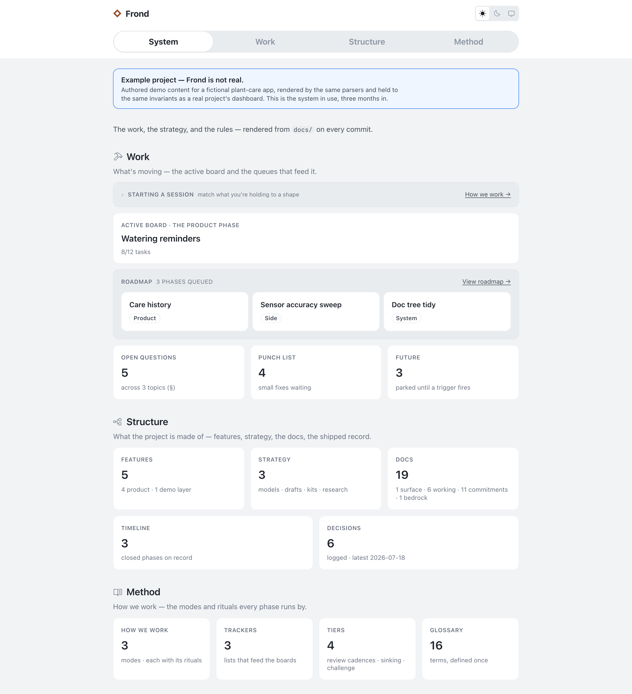

# Groundwork

A project operating system you copy, not a starter app.

It gives a project three things: a work model (phases, modes, rituals), a small shelf of living docs, and a `/system` dashboard rendered from those docs on every build.

**The one rule: derived, never authored.** The docs are the truth. The dashboard renders them. Finished work leaves the working set instead of piling up. Keep that rule and the project stays legible at any size.

<picture>
  <source media="(prefers-color-scheme: dark)" srcset=".github/system-overview-dark.png">
  
</picture>

*The dashboard of a project in flight. (Staged demo content: "Frond," a fictional plant-care app.)*

**[Click around the real thing →](https://groundwork-day-one.vercel.app/system)** — the day-one surface a fresh copy gives you: kickoff board open, trackers empty, strategy stubbed.

## How it works

Work happens in phases. Every phase runs in one of three modes:

- **Product** builds the thing. The deepest ritual: thesis, build, walkthrough, close.
- **System** tends the rules, the docs, and the dashboard itself.
- **Side** sweeps small fixes and open questions from the trackers.

A phase opens a board, does the work, and closes by distill and delete. Decisions go to the log. Behavior goes to feature docs. The board is removed. History lives in git and a compact archive, not in the working set.

The dashboard shows it all live: the active board, the queue, open questions, decisions, doc health, the styleguide. Nothing on it is hand-written. To change a page, change its source doc.

## Built for agent-assisted work

`CLAUDE.md` is a standing briefing for a coding agent (Claude Code or similar). A "session" is one chat. The rituals assume the agent does the mechanical parts while you make the calls.

Everything is plain markdown, so it all works by hand too.

## First 30 minutes

1. Copy the repo (or "Use this template" on GitHub).
2. `npm install && npm run dev`, then open [localhost:3000/system](http://localhost:3000/system).
3. The **Kickoff board** is already open on the dashboard. It is the one-time bootstrap that turns the empty template into your project.
4. Work it with **`KICKOFF.md`** (repo root) as the guide: answer the seeded questions, fill the strategy shelf, choose your stack, name the project, decide where your record lives, make the identity yours, set the roadmap.

The kickoff's close ritual replaces this README with your project's own and deletes `KICKOFF.md`. The template leaves no onboarding behind. What remains is your project.

Not a web project? The methodology works without the app. Delete `app/`, `components/`, `lib/`, and the web config; keep `docs/` and `CLAUDE.md`.

## Two audiences

Your product is public. Your record is not.

`/system` renders the strategy, decisions, and open questions, so it ships gated. Local dev is open with no setup. On a deploy, set `SYSTEM_PASSWORD` to put it behind a password, or `SYSTEM_GATE=off` to make it deliberately public. Set neither and it blocks itself and tells you which one to set, so forgetting can never publish your record.

## License

MIT.
