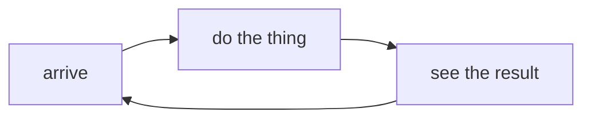
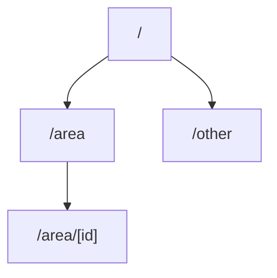

# [Run name] — the picture

> **How this works**
>
> **This is a reading aid, not a record.** One frame of the run for a person arriving cold: the loop it builds, the site it is building toward, and who owns which parts. **Every fact here has a home elsewhere** — the thesis on the run board, the scope in the scope doc, each member's stage in its own frontmatter — and this file restates them so they can be seen at once. When the picture and a home disagree, the home wins; fix the picture. Written by the run's **open** kind, linked from the run board's `Picture:` line, re-read by the survey. **At the close the aspirational site map is reconciled against the derived one** (`/system/site`): what exists in both is done; what only the aspiration holds goes to the queue, to Future Considerations, or is dropped with a note in `decisions.md`. **The loop map is lifted to a durable authored home** — the vision or the feature doc it describes — never deleted with this file. Then this file goes (`CONTRIBUTING.md` → The phase pipeline).

## The loop

*(The flow the run builds, end to end, as the user moves through it — authored, one map. Name the steps in the product's own words.)*

## The aspirational site map

*(The IA the run is building toward, drawn from the scope doc — authored. One node per page; a page not yet built is still drawn, because that is what the close reconciles against `/system/site`.)*

## Who owns which parts

*(One row per member board. Overlaps are stated, not discovered: two members touching one page say so here.)*

| Member | Its arc | Its pages | Stage | Overlaps |
|--------|---------|-----------|-------|----------|
| *(board name)* | *(the slice of the loop it builds)* | *(paths from the map above)* | *(its `stage:`)* | *(the member it shares a page with, or none)* |

---

> **Before you fill this in — then delete this card**
>
> Keep the maps small enough to read in one screen each; a map that needs scrolling is two maps. Paths in the site map and the Pages column are written as they will appear in the routes tree (`/area/[id]`, dynamic segments in brackets), because the close matches them against the derived map by path. The survey table on the run board — shown / launch / later — is the other half of that match: a route with no row there is a drift alarm on `/system`.
